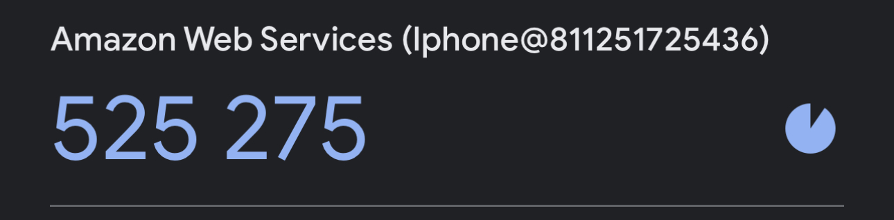

# Week 0 — Billing and Architecture
## Required Homework

- [Lucid ChartCruddur Logical Diagram](https://lucid.app/lucidchart/4f50200a-b928-415b-8984-7438893550f0/edit?view_items=P2aEpHyRxF8Z&invitationId=inv_afc1738d-6791-458d-af43-780f5ba9c514)

- [Cruddur Conceptual Diagram](https://lucid.app/lucidchart/94f26238-584f-4058-a782-5dd3f534592e/edit?view_items=Pp9DLvXx_xRX&invitationId=inv_1caafa39-0a33-4c58-9e5c-be6551083676)

### Budget

### Billing Alarm

## Homework Challenges
- [LucidnChart CI/CD Diagram](https://lucid.app/lucidchart/a545170a-c3a9-4f4a-bfbf-b9efa28b2f28/edit?viewport_loc=24%2C-254%2C2319%2C1176%2C0_0&invitationId=inv_556eab06-dccb-4144-ae1f-6ebc067eedc1)

- I added MFA to my Admin User through the google authenticator app

