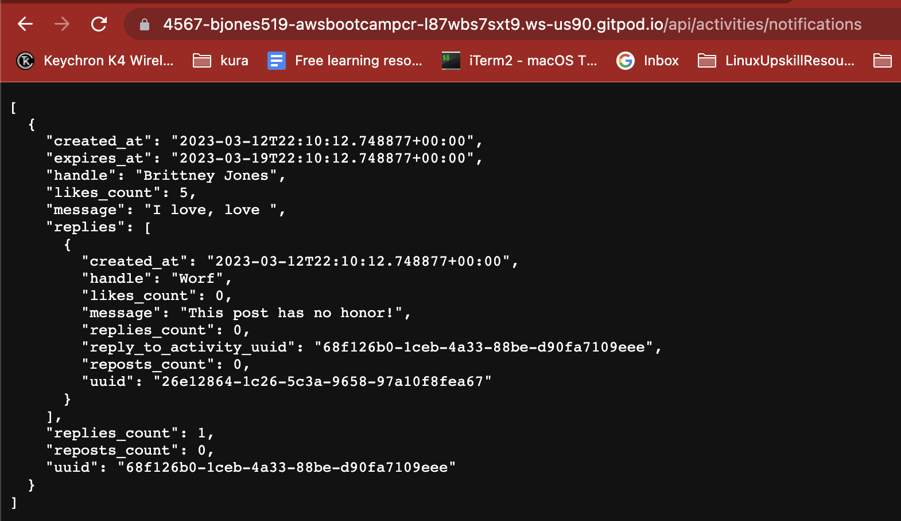
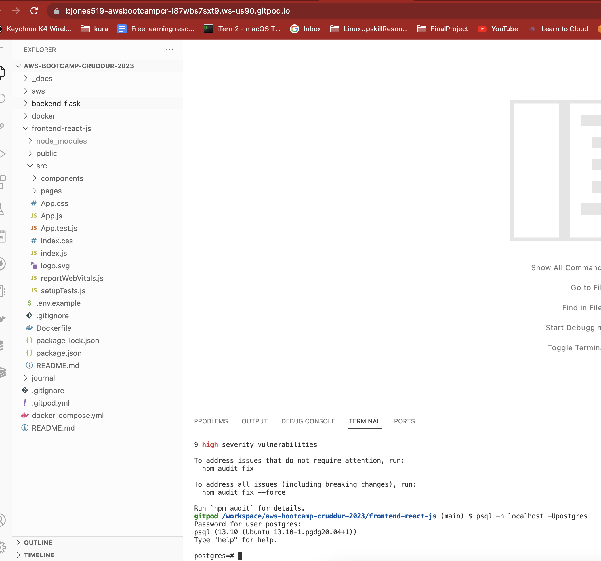
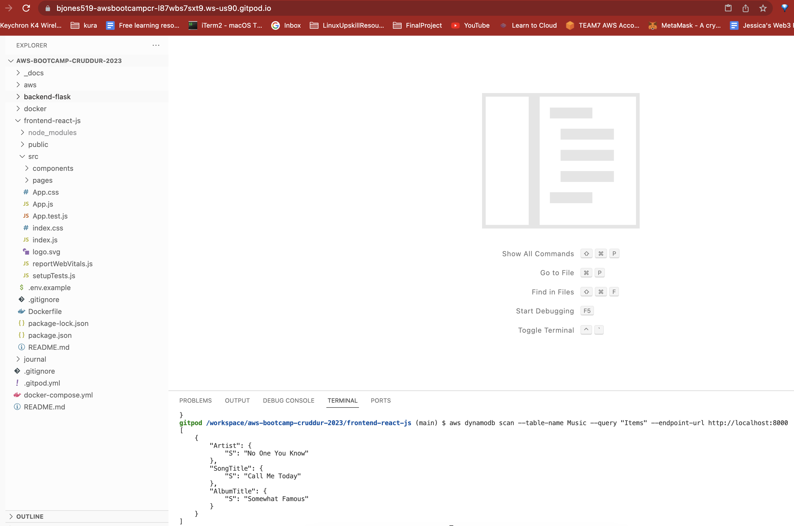
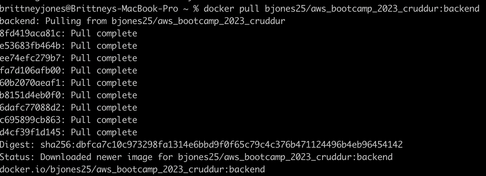

# Week 1 — App Containerization

## Required Homework
 I got the frontend react page for notifications working
 
 I got the backend notification endpoint working 
 

 I got the postgres container working
 
 
 I got the dynamoDB container working
 
 

## Homework Challenges
Link to the DockerHub repo that I pushed and tagged the images to: [here](https://hub.docker.com/r/bjones25/aws_bootcamp_2023_cruddur/tags)

I was able to install Docker locally and pulled down the images I pushed to DockerHub and get the containers running

I also got the front end container running but I think there is an issue with the communication between backend and frontend because the cruddur app loads but the feed is blank. Trouble shooting to see if I can get it working
